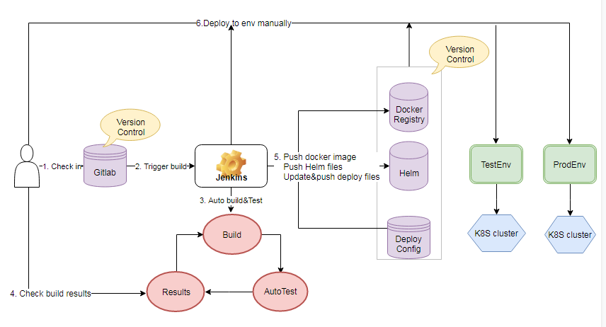
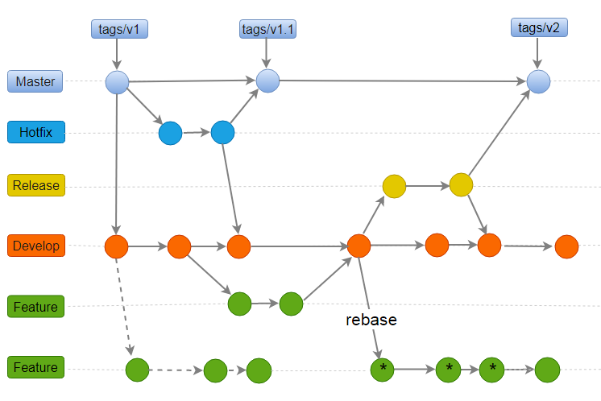

## DevOps过程
### DevOps过程简介
- 源文件（包括源码及其相关的资源）使用gitlab进行版本控制；

- 持续构建及发布使用Jenkins实现，通过Job设置可实现手动或者自动的构建部署；

- 构建产出品包括Docker镜像、Helm包及环境相关的配置文件，分别通过Docker Registry、Helm和配置库实现版本控制；

- 根据需求，选择不同的产出品（Image版本+Helm+配置文件）版本部署到测试环境或者生产环境；

- 测试环境和生产环境均是基于Kubernetes集群实现的服务编排部署。

- UTCOP平台DevOps过程图如下：

### 配置管理

#### 分支策略

- Master分支记录当前最新版本的状态，版本tag基于master分支创建；
- Hotfix分支用来修复已发布版本的问题，修复完成后，merge到master分支和develop分支；
- Develop分支为主开发分支，主要的开发活动基于此分支进行，所有的功能分支基于develop分支创建；
- Release分支为产品发布分支，基于develop分支创建，在release分支上的修改merge需要merge到develop分支，基于relase分支的发布版本merge到Master，基于master创建发布标签；
- feature分支为功能开发分支，基于develop分支创建，完成后merge到develop分支；
- 分支策略采用git workflow 分支策略图如下所示：

#### 版本定义

- 版本号定义：major.minor.dot3
- 构建标签格式：tags/build/BYYYYMMDDHHMM
- 发布标签格式: tags/release/vX.X.X

### 持续构建

- 构建：Jenkins job调用项目的build.sh生成war包，基于Dockerfile构建镜像，同时根据模板及参数定义生成项目集群部署yaml文件。脚本列表如下：
   - build.sh
   - ci/Dockerfile
   - ci/build.sh
   - k8s/build.sh
- 自动化测试：自动调用项目单元测试

- 构建结果：如果构建过程成功，将构建产生的镜像推送至镜像仓库，同时生产相应环境的项目配置文件，推送至项目配置库。 

### 持续部署

Jenkins Job实现手动部署入口：

- 测试环境部署

  可基于项目某个具体发布版本或者项目研发过程的构建版本部署测试环境，部署参数设置项目版本号/项目构建号+yaml文件

- 生产环境部署

    只能基于某个具体的发布版本部署生产环境， 部署参数设置：项目版本号+yaml文件
    
**CI构建**

# 环境搭建
gitlab、jenkins、helm（可选）

# 
