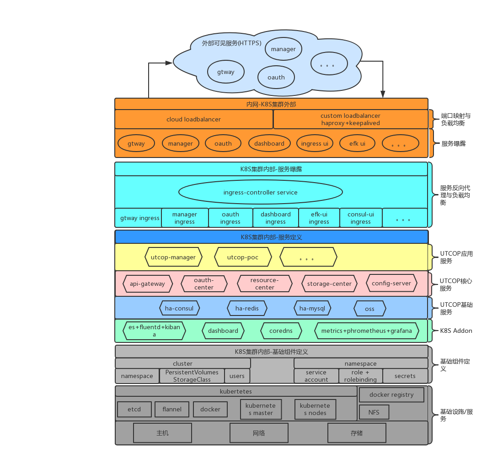

# 云原生

UTCOP平台及其基于DevOps最佳实践的研发部署过程体系简介

# 服务体系结构
整个体系中的服务主要包含三大类：平台基础服务、UTCOP基础服务、UTCOP核心服务；

## [平台基础服务/Addon](./structure/k8sbasic-service.md)
kubernetes 运行不可或缺的插件，如 DNS、Log、Metric等；

## [UTCOP基础服务](./structure/utcopbasic-service.md)
UTCOP 平台的基础，如高可用数据库、分布式缓存、配置中心、服务注册中心、分布式对象存储等；

## [UTCOP核心服务](./structure/utcopcore-service.md)
UTCOP 平台的核心服务，如统一认证授权中心、资源中心、存储仓等；

# DevOps过程
[项目结构](./ci/project.md)

[DevOps过程](./ci/buildflow.md)

# 部署与配置
`kubernetes + 自由算力` 为基础设施；并配套使用一些开源项目进行；

## 环境搭建
### [开发](./compose/env/dev.md) 
基于 minikube 搭建单节点集群

### [测试生产](./compose//env/test-prod.md)
自由算力（自有DC、私有云、公有云）作为承载；linux 操作系统之上使用 `kubeasz` 一键完成 Kubernetes 运行环境的搭建；

## [网络规划](./compose//network.md) 
域名 、IP 、 NodePort 的分配规划

# [服务空间隔离与规划](./ns-consist.md)
根据服务的功能将其划分到不同的命名空间中，起到逻辑隔离作用

# [基础服务安装](./setup-service/README.md)
UTCOP 使用 kubernets 进行部署需要的基础服务安装

# [访问安全控制](./compose//access-control.md)
严格控制集群管理内外/内外网 的服务可见性与身份认证授权；

# [负载均衡](./compose//lb.md) 
Ingress + LB

# 服务治理
## [监控](./servicemng/monitor.md)
监控容器和集群的状态，并展示、告警

## [自动伸缩](./servicemng/auto-scale.md)
根据流量与机器负载自动进行服务数量的伸缩；

## [版本升级](./servicemng/upgrade.md)
服务新版本管理：重建、滚动升级

## [日志](./servicemng/logging.md)
容器日志收集、处理和搜索

## [集群联邦](./servicemng/federa.md)
多地域集群负载均衡、高可用

# 备份与回复
有状态服务数据的备份与回复，mysql、oss、redis、consul

