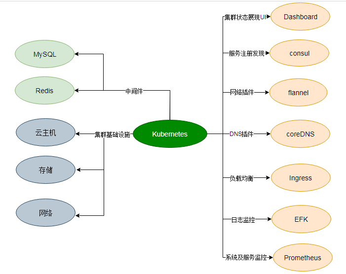

**部署环境配置**

UTCOP 部署环境采用开源项目[`kubeasz`](https://github.com/easzlab/kubeasz)，基于二进制方式实现高可用`kubernetes`集群基础组件安装。


### 1. 安装kubernetes基础组件
#### 1.1 高可用集群所需节点配置如下

|角色|数量|描述|
|:-|:-|:-|
|管理节点|1|运行ansible/easzctl脚本，可以复用master，建议使用独立节点（1c1g）|
|etcd节点|3|注意etcd集群需要1,3,5,7...奇数个节点，一般复用master节点|
|master节点|2|高可用集群至少2个master节点|
|node节点|3|运行应用负载的节点，可根据需要提升机器配置/增加节点数|

#### 1.2 集群节点初始化配置
集群节点初始话配置参照：[环境初始化配置](https://github.com/easzlab/kubeasz/blob/master/docs/setup/00-planning_and_overall_intro.md)

#### 1.3 一键安装集群基础组件

``` bash
# 下载工具脚本easzup
$ curl -C- -fLO --retry 3 https://github.com/easzlab/kubeasz/releases/download/${release}/easzup
$ chmod +x ./easzup
# 使用工具脚本下载
$ ./easzup -D
```

上述脚本运行成功后，所有文件（kubeasz代码、二进制、离线镜像）均已整理好放入目录`/etc/ansilbe`

- `/etc/ansible` 包含 kubeasz 版本为 ${release} 的发布代码
- `/etc/ansible/bin` 包含 k8s/etcd/docker/cni 等二进制文件
- `/etc/ansible/down` 包含集群安装时需要的离线容器镜像

```
#根据集群规划修改`hosts`文件
$ cp /etc/ansible/example/hosts.allinone /etc/ansible/example/hosts
# 执行安装
$ ansible-playbook /etc/ansible/90.setup.yml
```

### 2. 安装kubernetes addons
#### 2.1 安装DNS插件（coreDNS）、网络插件（flannel）、dashboard、metric-server、Ingress-controller(treafik)
1. 根据kubeasz设置，一键安装配置集群过程中已经默认安装了插件：coreDNS、flannel、dashboard、metric-server。
2. 配置安装treafik

为了保证Ingress高可用，配置两个节点的Ingress-controller。
修改 `/etc/ansible/manifests/ingress/treafik/treafic-ingres.yaml `中`Deployment`的`spec.replicas`为2,执行：
```
$ kubectl create -f /etc/ansible/manifests/ingress/traefik/traefik-ingress.yaml
```
参考：[kubeasz ingress配置](https://github.com/easzlab/kubeasz/blob/master/docs/guide/ingress.md)

#### 2.2 安装log监控组件EFK
EFK 插件是k8s项目的一个日志解决方案，它包括三个组件：Elasticsearch, Fluentd, Kibana；
Elasticsearch 是日志存储和日志搜索引擎，Fluentd 负责把k8s集群的日志发送给 Elasticsearch, Kibana 则是可视化界面查看和检索存储在 ES 中的数据。

- 根据kubeasz的脚本，使用动态PV的EFK。参考：[使用动态PV安装EFK](https://github.com/easzlab/kubeasz/blob/master/docs/guide/efk.md#使用动态-pv安装-efk)
```
# 安装动态PV 的 EFK
$ kubectl apply -f /etc/ansible/manifests/efk/
$ kubectl apply -f /etc/ansible/manifests/efk/es-dynamic-pv/
```

#### 2.3 安装consul

consul是一种支持多数据中性，分布式的、高可用、横向扩展的服务发现框架。一致性协议采用 Raft 算法,用来保证服务的高可用. 使用 GOSSIP 协议管理成员和广播消息, 并且支持 ACL 访问控制.

UTCOP平台consul服务采用Helm chart方式安装：
```
# Clone the chart repo
$ git clone https://github.com/hashicorp/consul-helm.git
$ cd consul-helm
# 获取consul-helm发布版本
$ git checkout v0.1.0
# 运行Helm
$ helm install --name consul ./
#通过端口隐射提供consul sevice外部访问
$ kubectl port-forward consul-server-0 8500:8500
```

### 3. 安装UTCOP平台所需中间件
#### 3.1 安装redis
[Redis](https://redis.io/)(Remote Dictionary Service)Redis是一个开源的使用ANSI C语言编写、遵守BSD协议、支持网络、可基于内存亦可持久化的日志型、Key-Value数据库，并提供多种语言的API。

它通常被称为数据结构服务器，因为值（value）可以是 字符串(String), 哈希(Hash), 列表(list), 集合(sets) 和 有序集合(sorted sets)等类型。

UTCOP平台使用`redis`缓存平台数据。 

1. 创建`redis` configMap、service、statfulset,可根据具体配置修改`manifests/*.yaml`：
```
#基于redis server配置创建configMap
$kubectl create -f manifests/redis-configMap.yaml
#创建redis-cluster service
$kubectl create -f manifests/redis-service.yaml
#创建redis statefulset
$kubectl create -f manifests/redis-statefulset.yaml
```
查看redis是否成功创建：
```
$kubectl get po |grep redis
```

2. 执行创建集群命令
```
$kubectl exec -it -n utcop redis-cluster-0 -- redis-cli --cluster create $(kubectl get pods -l app=redis-cluster -n utcop -o jsonpath='{range.items[*]}{.status.podIP}:6379 ') --cluster-replicas 1
```

3. redis集群可用性检查参照：[Redis集群教程](http://redisdoc.com/topic/cluster-tutorial.html)


#### 3.2 安装mysql

