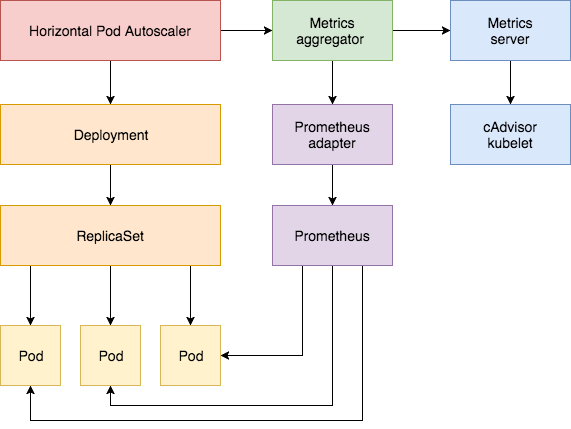

**自动伸缩**

# 概念
自动扩展是一种根据资源使用情况自动扩展或降低工作负载的方法

Kubernetes中的自动缩放有两个维度：
* Cluster Autoscaler 处理工作节点数量缩放操作；
* HPA 可自动缩放在 depolyment 或 replica set 中 Pod 的数目；
Cluster Autoscaling 与 Horizo​​ntal Pod Autoscaler（HPA）组合可用于动态调整计算能力以及满足系统SLA所需的并行度。

Cluster Autoscaler高度依赖托管您的集群的云提供商的基础功能；HPA可以独立于 IaaS / PaaS提供商运营。


# HPA
Horizontal Pod Autoscaling (HPA) 可以根据 CPU 、Memory 使用率或应用自定义 metrics 自动扩展 Pod 数量；

Horizo​​ntal Pod Autoscaler实现为一个控制循环，定期查询 Resource Metrics API 以获取CPU /内存等核心指标和针对特定应用程序指标的Custom Metrics API。


示例：定义一个至少维护两个副本的HPA，如果CPU平均值超过80％或内存超过200Mi，则最多可扩展到10个。
```yaml
apiVersion: autoscaling/v2beta1
kind: HorizontalPodAutoscaler
metadata:
  name: podinfo
spec:
  scaleTargetRef:
    apiVersion: extensions/v1beta1
    kind: Deployment
    name: podinfo
  minReplicas: 2
  maxReplicas: 10
  metrics:
  - type: Resource
    resource:
      name: cpu
      targetAverageUtilization: 80
  - type: Resource
    resource:
      name: memory
      targetAverageValue: 200Mi
```

[k8s-prom-hpa](https://github.com/stefanprodan/k8s-prom-hpa)


# Cluster Autoscaler

Cluster AutoScaler 是一个自动扩展和收缩 Kubernetes 集群 Node 的扩展。当集群容量不足时，它会自动去 Cloud Provider （支持 GCE、GKE、Azure、AKS、AWS 等）创建新的 Node，而在 Node 长时间（超过 10 分钟）资源利用率很低时（低于 50%）自动将其删除以节省开支。

Cluster Autoscaler 仅根据 Pod 的调度情况和 Node 的整体资源使用情况来增删 Node，跟 Pod 或 Node 的资源度量（metrics）没有直接关系

[cluster-autoscaler](https://kubernetes.feisky.xyz/bu-shu-pei-zhi/index-1/cluster-autoscaler)